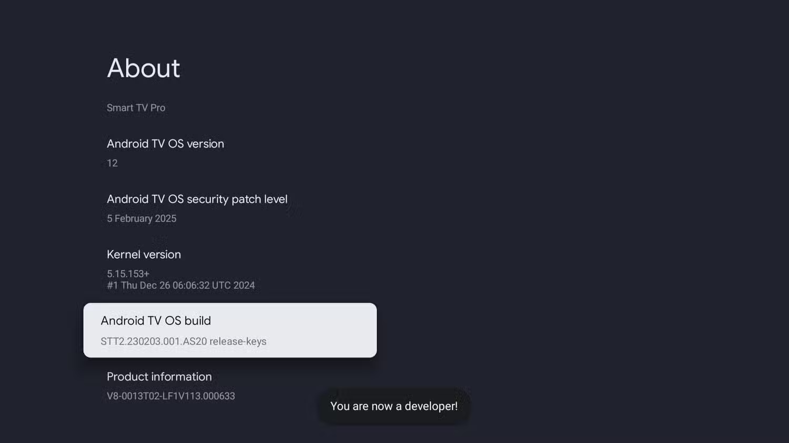
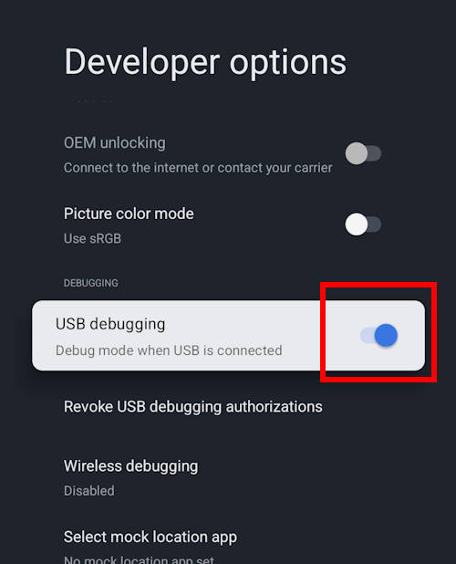
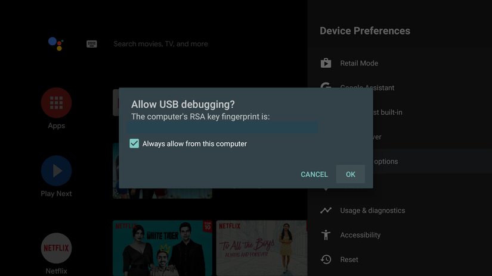

::: version-info
Last updated .
:::

# General Overview

#### The Problem

- The SONY TVs at Oak House do not allow end-users to connect to EAP WiFi networks like `UofT` or `eduroam`.

#### The Solution

- Using a [specially developed app](https://github.com/SmatMan/Enterprise-WiFi), we can create a connection to the secure UofT wifi networks manually.
- However, installing the app is a little time consuming. See the procedure below.

# Procedure

## Prerequisite USB/ADB & Internet Setup

> In order to install the application, we need to temporarily enable developer access on the TV. Developer access allows us to install apps on the TV from outside the Google Play store through a computer

1. Go to **Settings** -> **System** -> **About**, scroll down to select **Android TV OS build**. Click this field multiple times until you see a popup that states _"You are now a developer"_.

{width=600 fig-align="left"}

2. Go back to **Settings** -> **System** and find **Developer Options**
3. Scroll down to find **USB debugging** and enable this.

{width=300 fig-align="left"}

> We will need to remember to disable this later!!

---

### Temporary Internet Connection

> Now that we have enabled developer access, we need to find a way to communicate _with_ the TV. Since the TV is not connected to the network, we have no way of communicating with it.

> The current way I have been doing this is using the blueish router in the drawer.

1. Plug the GLinet router into the wall with its associated plug. Use an ethernet cable from the laptop bag (or any other ethernet cable) to connect either port from the back of the router to the ethernet port on the side of the TV.
1. Wait a minute or two for the router's light to stop flashing, indicating its done starting up.
1. Connect the laptop to the wifi network beginning with `GLinet` and ending with `5G`.
   - If at any point the `adb` commands fail, it's very likely the laptop disconnected from the router and is back on the UofT/eduroam network.
1. Identify the temporary IP address of the TV in **Settings** -> **Network and Internet**

## Installing the App onto the TV

> There are **TWO** versions of the application you can install on the TV. `preset-wifi.apk` and `no-preset-wifi.apk`. The preset version includes the private credentials used to connect only the **Common Room TVs** to the wifi. Do not install the `preset-wifi.apk` file on any student TVs. Instead, use `no-preset-wifi.apk`.

1. On the laptop, open the terminal, type `adb connect IP_ADDRESS`, where `IP_ADDRESS` is replaced by the IP you gathered earlier, and hit the Enter key.
1. On the TV, a prompt will appear asking to confirm the debugging connection. Allow this.

   - It might be convenient to tick the checkbox to "always allow from this computer" so that you never have to see this popup again.

{width=600 fig-align="left"}

   > At this point, a helpful debugging step to confirm if the laptop is connected to the TV or not, is to run `adb devices` in the terminal and read the response. If it shows a device as `connected`, you're good. If nothing is there, something is wrong 

1. Decide which version of the app you need to install.
   - `preset-wifi.apk` - ONLY for Common Room TVs. Includes special wifi credentials inside the app.
   - `no-preset-wifi.apk` - for Student TVs, requires a network name, username, and password to be inputted to connect the TV.
1. On the laptop, run either `adb install preset-wifi.apk` or `adb install no-preset-wifi.apk` depending on your choice to send the application to the TV.

## Connecting to the Network

1. Once the app is installed, unplug the ethernet connection to the TV.
2. Navigate to the applications menu on the TV, and launch "Enterprise Wi-Fi for TVs".
   - The app on first launch will prompt for location access, this should be allowed. If you press no, you will have to uninstall, and reinstall the application to try again.

### Common Room TVs

1. Scroll down inside the application to the **Connect To Preset** button, and select it. A popup should appear asking to connect to a Wi-Fi networks suggested by Enterprise Wifi. Press yes.
2. Navigate to **Settings** to confirm the connection. If it hasn't connected, go to **Settings** -> **System** -> **Restart** and it should be connected after the restart.

### Student TVs (if neccesary)
1. Type the network details into the app that the student would use to connect their regular computer to the wifi. Select `PEAP` and `MSCHAPv2` for the other options.

2. Navigate to **Settings** to confirm the connection. If it hasn't connected, go to **Settings** -> **System** -> **Restart** and it should be connected after the restart.

## Disabling Debug Access

> Now that the application is installed and the network has been connected, we need to disable ADB access.

1. Navigate to **Settings** -> **System** -> **Developer options**.
2. Disable **USB debugging**, and scroll to the top and disable **Enable developer options**
3. When you exit out this menu, the developer options menu should be gone.

> [You're done!]{.mark} The wifi connection should be working fine now.

# Appendix

### Removing the Network Configuration
1. To remove the saved network configuration, you must find the application in the apps menu and uninstall it.

> You won't be able to disconnect or forget the network from the settings page like you normally would.

> Eventually a "Disconnect" button will be implemented inside the app. Once it's finished, press it to disconnect the TV from wifi.

### Changing Credentials (WIP)

- To change credentials, modify the file in `app/src/res/raw/preset_config.json` / create a new file at `app/src/res/raw/preset_config.json` based on `preset_config.json_example` at root dir.
- Recompilation will be required in order to create a new APK to install the new credentials. Follow below instructions

- Set environment variable `ANDROID_HOME` to location of Android Development SDK (will expand)
- Run `./gradlew assembleDebug`.
- The compiled APK will be available in `app/build/outputs/apk/debug/app-debug.apk`

